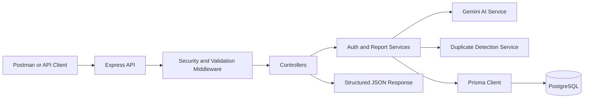
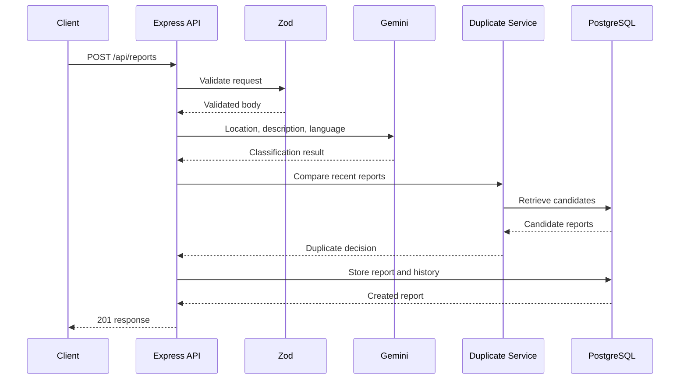
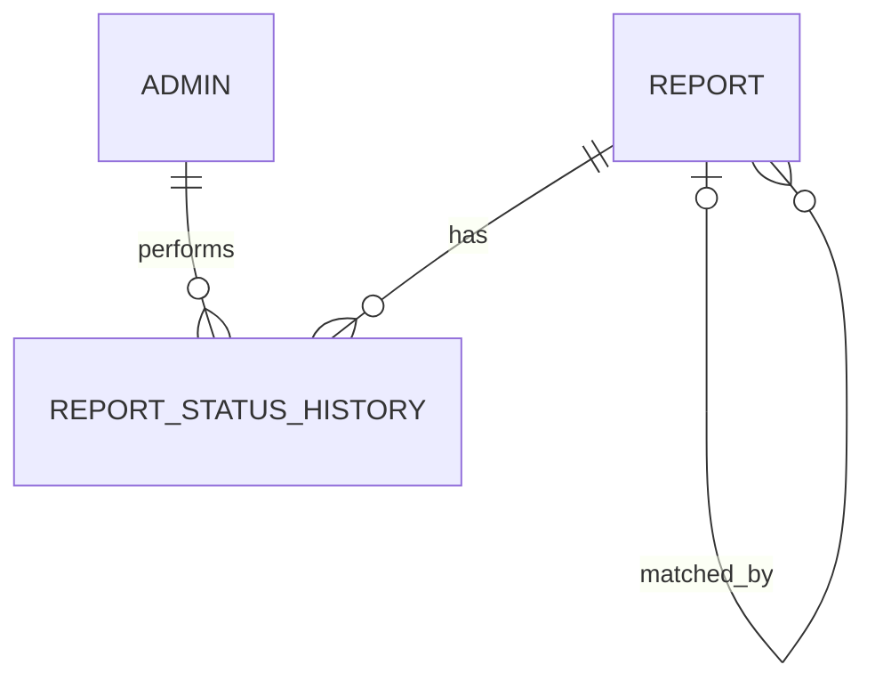

# CrisisDesk AI

**CrisisDesk AI** is a backend-only emergency and public-service request triage API. It accepts unstructured citizen reports in Bangla, English, or an unknown language; validates and stores them; uses AI to classify the incident and estimate urgency; detects possible duplicate reports; and provides protected administrative APIs for management and analytics.

> Replace these placeholders before final submission:
>
> - Live API: `https://crisisdesk-ai-hackathon.onrender.com`
> - GitHub repository: `https://github.com/saqib0404/crisisdesk-ai-hackathon`
> - Postman collection: `crisisdesk-ai-hackathon.postman_collection.json`

## Project overview

Emergency reports may be incomplete, multilingual, duplicated, or difficult to prioritize. CrisisDesk AI transforms each submitted message into a structured, searchable report.

```text
Citizen report
    ↓
Zod request validation
    ↓
Sensitive-data redaction for AI input
    ↓
Gemini classification and summarization
    ↓
Hybrid duplicate detection
    ↓
Prisma persistence in PostgreSQL
    ↓
Structured response
    ↓
Protected administration and analytics
```

This project is intentionally backend-only.

## Features

- Public report submission
- Bangla, English, and unknown-language support
- AI-generated category, urgency, summary, suggested action, and confidence
- Safe AI fallback with manual-review marking
- Hybrid duplicate detection using description, location, category, and time
- PostgreSQL persistence through Prisma
- Filtering, free-text search, date range, sorting, and pagination
- Status management with audit history
- Category and urgency analytics
- JWT administrator authentication
- Role-based authorization
- Zod validation and structured errors
- bcrypt password hashing
- Helmet, CORS, and API rate limiting
- Docker and Docker Compose
- Render-ready deployment
- Importable Postman collection

## Technology stack

| Layer | Technology |
|---|---|
| Runtime | Node.js |
| Language | TypeScript |
| HTTP framework | Express |
| Database | PostgreSQL |
| ORM and migrations | Prisma |
| Validation | Zod |
| AI | Google Gemini Developer API through `@google/genai` |
| Authentication | JSON Web Tokens |
| Password hashing | bcryptjs |
| Security | Helmet, CORS, express-rate-limit |
| Containers | Docker and Docker Compose |
| Deployment | Render with Neon PostgreSQL |
| API client | Postman |

## Architecture



### Report submission sequence



## Data model

The database contains three main models:

- `Report`: citizen input, AI output, duplicate information, status, and timestamps
- `Admin`: administrator identity, role, password hash, and activity status
- `ReportStatusHistory`: report status transitions and the administrator who performed them

A report may also reference another report through `matchedReportId`, creating a self-relation for duplicate detection.



## Allowed values

### Languages

```text
bn
en
unknown
```

### Categories

```text
medical
fire
accident
crime
flood
utility
public_service
infrastructure
other
```

### Urgency levels

```text
low
medium
high
critical
```

### Status values

```text
pending
in_review
assigned
resolved
rejected
```

## API endpoints

Base path:

```text
https://crisisdesk-ai-hackathon.onrender.com/api
```

| Method | Endpoint | Access | Purpose |
|---|---|---|---|
| GET | `/health` | Public | Health check |
| POST | `/auth/login` | Public | Administrator login |
| GET | `/auth/me` | Admin | Current administrator |
| POST | `/reports` | Public, rate-limited | Submit and process a report |
| GET | `/reports` | Admin | List, filter, search, sort, and paginate |
| GET | `/reports/stats/summary` | Admin | Analytics summary |
| GET | `/reports/:id` | Admin | Report details |
| PATCH | `/reports/:id/status` | Admin | Update status and create history |
| DELETE | `/reports/:id` | Super admin | Delete a report |

See [`docs/API_GUIDE.md`](docs/API_GUIDE.md) for detailed requests and responses.

## Example: submit a report

```http
POST /api/reports
Content-Type: application/json
```

```json
{
  "name": "Rahim",
  "contact": "01712345678",
  "location": "Sylhet Bondor Bazar",
  "description": "A shop is on fire and several people may be trapped inside.",
  "language": "en"
}
```

Typical result:

```json
{
    "success": true,
    "message": "Report submitted successfully.",
    "data": {
        "id": "cmriv59d100001sdh32l6hyuv",
        "name": "Rahim",
        "contact": "01712345678",
        "location": "Sylhet Bondor Bazar",
        "normalizedLocation": "sylhet bondor bazar",
        "latitude": null,
        "longitude": null,
        "description": "A shop is on fire and several people may be trapped inside.",
        "normalizedDescription": "a shop is on fire and several people may be trapped inside.",
        "translatedDescription": null,
        "language": "en",
        "category": "fire",
        "urgency": "critical",
        "summary": "A shop is currently on fire at Sylhet Bondor Bazar, with reports suggesting people may be trapped inside.",
        "suggestedAction": "Dispatch fire and rescue services immediately and initiate search and rescue operations.",
        "confidence": 0.95,
        "possibleDuplicate": true,
        "duplicateScore": 0.8812,
        "matchedReportId": "cmri65kx30002t8c0ata3r22v",
        "status": "pending",
        "requiresManualReview": false,
        "aiStatus": "success",
        "aiProvider": "google-gemini",
        "aiModel": "gemini-3.1-flash-lite",
        "aiMetadata": {
            "reason": null,
            "usedFallback": false,
            "duplicateDetection": {
                "breakdown": {
                    "timeSimilarity": 0.7571,
                    "categorySimilarity": 1,
                    "locationSimilarity": 1,
                    "descriptionSimilarity": 0.806
                },
                "threshold": 0.62,
                "evaluatedCandidates": 16
            }
        },
        "createdAt": "2026-07-13T06:50:37.861Z",
        "updatedAt": "2026-07-13T06:50:37.861Z",
        "matchedReport": {
            "id": "cmri65kx30002t8c0ata3r22v",
            "location": "Sylhet Bondor Bazar",
            "description": "A shop is on fire and several people are trapped inside. .",
            "category": "fire",
            "urgency": "critical",
            "status": "pending",
            "createdAt": "2026-07-12T19:11:02.439Z"
        },
        "statusHistory": [
            {
                "id": "cmriv59ib00011sdhczyxf7w8",
                "reportId": "cmriv59d100001sdh32l6hyuv",
                "previousStatus": null,
                "newStatus": "pending",
                "changedById": null,
                "note": "Report submitted and identified as a possible duplicate of cmri65kx30002t8c0ata3r22v.",
                "changedAt": "2026-07-13T06:50:37.861Z"
            }
        ]
    }
}
```

## Example: administrator login

```http
POST /api/auth/login
Content-Type: application/json
```

```json
{
  "email": "admin@crisisdesk.local",
  "password": "password1234"
}
```

Protected endpoints require:

```http
Authorization: Bearer <ACCESS_TOKEN>
```

## Filtering and pagination

Example:

```http
GET /api/reports?category=fire&urgency=critical&status=pending&page=1&limit=20&sortBy=createdAt&sortOrder=desc
```

Supported parameters:

| Parameter | Format |
|---|---|
| `category` | Allowed category |
| `urgency` | `low`, `medium`, `high`, `critical` |
| `status` | Allowed status |
| `language` | `bn`, `en`, `unknown` |
| `search` | Free text |
| `startDate` | `YYYY-MM-DD` |
| `endDate` | `YYYY-MM-DD` |
| `page` | Integer, minimum 1 |
| `limit` | Integer, 1–100 |
| `sortBy` | `createdAt`, `updatedAt`, `confidence` |
| `sortOrder` | `asc`, `desc` |

## AI processing

Only the following report fields are sent for classification:

- Location
- Description
- Language

The explicit `name` and `contact` fields are not sent to the AI service. Common phone numbers and email addresses found inside the description are redacted.

The AI result is constrained to the allowed categories and urgency levels, then validated again with Zod before storage.

When the AI request fails, times out, returns invalid data, or reaches a free-tier quota, the report is still stored using a safe fallback:

```json
{
  "category": "other",
  "urgency": "medium",
  "confidence": 0,
  "aiStatus": "fallback",
  "requiresManualReview": true
}
```

## Duplicate detection

Duplicate detection runs locally without a second paid API request. The weighted score is:

```text
Description similarity  55%
Location similarity     25%
Category match          15%
Time proximity           5%
```

The strongest candidate must pass:

- The total-score threshold
- The minimum location-similarity threshold
- The minimum description-similarity threshold

Stored results include:

- `possibleDuplicate`
- `duplicateScore`
- `matchedReportId`
- Threshold, candidate count, and score breakdown in `aiMetadata`

Duplicates point to the canonical original report rather than forming chains.

## Security

- JWT signature, expiration, issuer, audience, and role verification
- Active-administrator database check
- bcrypt password hashing
- `super_admin` permission for deletion
- Strict Zod request validation
- Structured malformed-JSON handling
- Helmet security headers
- Configurable CORS
- General, login, and report-submission rate limits
- Request body size limit
- Sensitive-data redaction before AI processing
- Report text treated as untrusted data
- Secrets stored in environment variables and excluded from Git

## Error format

```json
{
  "success": false,
  "error": {
    "code": "VALIDATION_ERROR",
    "message": "Request validation failed.",
    "details": [
      {
        "field": "body.location",
        "message": "Location is required.",
        "code": "invalid_type"
      }
    ]
  }
}
```

Possible error codes include:

```text
INVALID_JSON
VALIDATION_ERROR
REPORT_NOT_FOUND
AUTHENTICATION_REQUIRED
INVALID_ACCESS_TOKEN
INVALID_CREDENTIALS
INSUFFICIENT_PERMISSION
STATUS_UNCHANGED
ROUTE_NOT_FOUND
API_RATE_LIMIT_EXCEEDED
LOGIN_RATE_LIMIT_EXCEEDED
REPORT_RATE_LIMIT_EXCEEDED
INTERNAL_SERVER_ERROR
```

## Environment variables

Create `.env` from `.env.example`. Never commit the real file.

| Variable | Required | Purpose |
|---|---:|---|
| `NODE_ENV` | Production | Runtime mode |
| `PORT` | Local | HTTP port |
| `DATABASE_URL` | Yes | Runtime PostgreSQL connection |
| `DIRECT_URL` | Recommended | Direct migration connection |
| `GEMINI_API_KEY` | AI | Gemini credential |
| `GEMINI_MODEL` | AI | Selected free model |
| `AI_TIMEOUT_MS` | No | AI timeout |
| `AI_MANUAL_REVIEW_THRESHOLD` | No | Manual-review confidence threshold |
| `DUPLICATE_THRESHOLD` | No | Duplicate threshold |
| `DUPLICATE_LOOKBACK_HOURS` | No | Candidate time window |
| `DUPLICATE_CANDIDATE_LIMIT` | No | Candidate limit |
| `DUPLICATE_MIN_LOCATION_SIMILARITY` | No | Minimum location score |
| `DUPLICATE_MIN_DESCRIPTION_SIMILARITY` | No | Minimum description score |
| `JWT_SECRET` | Yes | JWT signing secret |
| `JWT_EXPIRES_IN_SECONDS` | No | Token lifetime |
| `JWT_ISSUER` | No | Token issuer |
| `JWT_AUDIENCE` | No | Token audience |
| `ADMIN_NAME` | Bootstrap | Administrator name |
| `ADMIN_EMAIL` | Bootstrap | Administrator email |
| `ADMIN_PASSWORD` | Bootstrap | Administrator password |
| `CORS_ORIGINS` | Production | Browser allowlist |

## Local setup

### Prerequisites

- Node.js and npm
- PostgreSQL
- A Gemini API key
- Docker Desktop for containerized execution

### Installation

```bash
git clone <YOUR_GITHUB_REPOSITORY_URL>
cd crisisdesk-ai-hackathon
npm install
```

Copy the environment template:

```bash
cp .env.example .env
```

Windows PowerShell:

```powershell
Copy-Item .env.example .env
```

Generate Prisma Client and migrate:

```bash
npx prisma generate
npx prisma migrate dev
```

Seed the administrator:

```bash
npx tsx prisma/seed.ts
```

Start development:

```bash
npm run dev
```

Verify:

```http
GET http://localhost:5000/api/health
```

## Docker

Start the API and PostgreSQL:

```bash
docker compose up --build
```

Background mode:

```bash
docker compose up --build -d
```

Inspect:

```bash
docker compose ps
docker compose logs -f api
```

Stop without deleting data:

```bash
docker compose down
```

Reset all local Docker database data only when intended:

```bash
docker compose down -v
```

## Postman collection

The exported Postman collection is stored in the project root:

```text
crisisdesk-ai-hackathon.postman_collection.json
```

Import steps:

1. Open Postman.
2. Select **Import**.
3. Select the JSON collection from the repository root.
4. Open the collection's **Variables** tab.
5. Set `baseUrl` to `http://localhost:5000` or the deployed URL.
6. Send the login request.
7. The login post-response script saves the JWT in `adminToken`.
8. Protected requests inherit collection-level Bearer authentication.

Collection variables:

```text
{{baseUrl}}
{{adminToken}}
```

Use **No Auth** for:

- Health
- Login
- Report submission

Use **Inherit auth from parent** for protected endpoints.

## Deployment

The application is Docker-ready. The implemented deployment uses:

- Render for the web service
- Neon for PostgreSQL
- Gemini Developer API for AI processing

The production service must receive secrets through the hosting dashboard. It listens on `process.env.PORT` and `0.0.0.0`.

Health-check path:

```text
/api/health
```

Verify this order after deployment:

1. Health
2. Login
3. Original report
4. Paraphrased duplicate
5. Report list
6. Report details
7. Status update
8. Analytics
9. Super-admin deletion

## Repository structure

```text
.
├── prisma/
│   ├── migrations/
│   ├── schema/
│   └── seed.ts
├── src/
│   ├── config/
│   ├── errors/
│   ├── generated/
│   ├── middleware/
│   ├── modules/
│   │   ├── auth/
│   │   └── reports/
│   ├── scripts/
│   ├── services/
│   ├── utils/
│   ├── app.ts
│   └── server.ts
├── docs/
│   ├── API_GUIDE.md
│   └── ARCHITECTURE.md
├── crisisdesk-ai-hackathon.postman_collection.json
├── .dockerignore
├── .env.example
├── .gitignore
├── ATTRIBUTIONS.md
├── Dockerfile
├── docker-compose.yml
├── package.json
├── package-lock.json
├── prisma.config.ts
├── README.md
└── tsconfig.json
```

## Third-party credits

CrisisDesk AI uses the following open-source libraries, frameworks, APIs, SDKs, platforms, and developer tools. Their authors retain all rights to their work, names, and trademarks.

| Technology | Use | Project |
|---|---|---|
| Node.js | Runtime | [Node.js](https://nodejs.org/) |
| TypeScript | Typed source | [TypeScript](https://www.typescriptlang.org/) |
| Express | HTTP API | [Express](https://expressjs.com/) |
| Prisma | Schema, migrations, ORM | [Prisma](https://www.prisma.io/) |
| PostgreSQL | Database | [PostgreSQL](https://www.postgresql.org/) |
| `pg` | PostgreSQL driver | [node-postgres](https://node-postgres.com/) |
| `@prisma/adapter-pg` | Prisma PostgreSQL adapter | [Prisma](https://www.prisma.io/) |
| Zod | Validation | [Zod](https://zod.dev/) |
| Google Gemini Developer API | AI service | [Gemini API](https://ai.google.dev/) |
| `@google/genai` | Gemini JavaScript SDK | [Google Gen AI SDK](https://github.com/googleapis/js-genai) |
| bcryptjs | Password hashing | [bcrypt.js](https://github.com/dcodeIO/bcrypt.js) |
| jsonwebtoken | JWT signing and verification | [node-jsonwebtoken](https://github.com/auth0/node-jsonwebtoken) |
| Helmet | HTTP security headers | [Helmet](https://helmetjs.github.io/) |
| CORS middleware | Browser-origin handling | [expressjs/cors](https://github.com/expressjs/cors) |
| express-rate-limit | Rate limiting | [express-rate-limit](https://github.com/express-rate-limit/express-rate-limit) |
| dotenv | Environment loading | [dotenv](https://github.com/motdotla/dotenv) |
| Docker | Containers | [Docker](https://www.docker.com/) |
| Postman | API collection | [Postman](https://www.postman.com/) |
| Render | Deployment | [Render](https://render.com/) |
| Neon | Hosted PostgreSQL | [Neon](https://neon.tech/) |

Exact installed versions and transitive dependencies are recorded in `package-lock.json`. Check each package's own repository and license file for its governing terms. Additional credits are available in [`ATTRIBUTIONS.md`](ATTRIBUTIONS.md).

## Privacy and responsible use

- Use fictional personal information in demonstrations.
- Do not submit real emergencies to this prototype.
- The API does not contact emergency responders.
- AI output can be incorrect and requires human judgment.
- Never commit API keys, database credentials, JWT secrets, or admin passwords.
- Rotate any secret exposed through source control, screenshots, logs, or chat.

## Known limitations

- No frontend
- No direct dispatch, SMS, or email integration
- AI depends on the configured provider and free quota
- AI confidence is not a calibrated probability
- Duplicate detection may miss ambiguous or cross-script locations
- The duplicate algorithm is heuristic
- Free hosting may have cold starts
- Automated tests are not included in the current submission
- The prototype is not approved for operational emergency use

## Future improvements

- Swagger/OpenAPI UI
- Automated tests
- Geocoding and coordinate comparison
- Embedding-based duplicate detection
- Notification integrations
- Administrator dashboard
- Refresh tokens
- Audit export
- Human-feedback loops
- Multilingual summaries

## Submission information


```text
Team name: AI Alchemists
Team members: Saqib Ahmad, Shazid Mahmud, Kamal Hossain Parvez 
Repository URL: https://github.com/saqib0404/crisisdesk-ai-hackathon
Live API URL: https://crisisdesk-ai-hackathon.onrender.com
Demo video URL:
Postman collection: crisisdesk-ai-hackathon.postman_collection.json
```

## Disclaimer

CrisisDesk AI is an educational hackathon prototype. It is not an official emergency service and must not be relied upon as the sole channel for reporting real emergencies.
