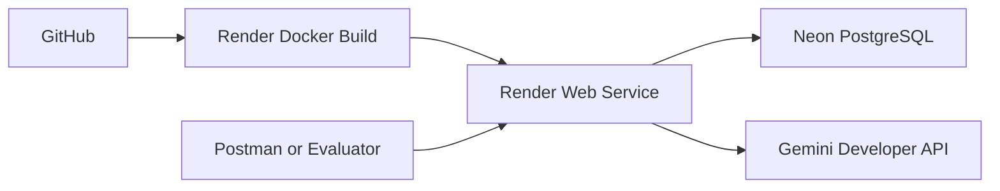

# CrisisDesk AI Architecture

## Style

CrisisDesk AI uses a modular monolith:

```text
Route
→ Middleware
→ Controller
→ Service
→ Prisma
→ PostgreSQL
```

AI processing and duplicate detection are isolated service modules.

## Main components

### Express application

- Security middleware
- JSON parsing
- Route registration
- Health endpoint
- Not-found and error handlers

### Validation

Zod validates bodies, path parameters, query parameters, enums, pagination, sorting, date ranges, and unsupported fields.

### Authentication

JWT middleware verifies signature, expiry, issuer, audience, and role. It then checks the administrator record in PostgreSQL and rejects inactive accounts.

### Controllers

Controllers handle HTTP concerns only: receive validated data, call services, select status codes, and return response envelopes.

### Report service

Coordinates classification, duplicate detection, persistence, filtering, pagination, status history, deletion, and analytics.

### Gemini service

- Excludes explicit reporter identity and contact
- Redacts common phone numbers and emails
- Treats report content as untrusted
- Requests structured output
- Validates the result with Zod
- Returns a safe fallback on failure

### Duplicate service

- Selects recent non-rejected candidates
- Normalizes Unicode text
- Uses stop-word removal and synonym mapping
- Combines token overlap and character n-grams
- Scores description, location, category, and time
- Applies component and final thresholds
- Links duplicates to the canonical original

### Prisma and PostgreSQL

Prisma provides the multi-file schema, migrations, generated client, transactions, relations, filters, and aggregations. PostgreSQL stores reports, administrators, and status history.

## Failure behavior

| Failure | Behavior |
|---|---|
| AI unavailable | Save fallback classification and require manual review |
| Invalid request | Reject before business logic or database access |
| Invalid token | Return `401` |
| Insufficient role | Return `403` |
| Missing report | Return `404` |
| Unchanged status | Return `409` |
| Unexpected failure | Return structured `500` and log server-side |

## Deployment



Container startup:

```text
prisma migrate deploy
→ bootstrap super administrator
→ connect Prisma
→ start Express on process.env.PORT and 0.0.0.0
```

## Security boundaries

- Anyone may submit a report.
- Administrators may read, filter, analyze, and update reports.
- Only super administrators may delete reports.
- The AI provider receives only necessary report content after redaction.
- Secrets remain server-side.
